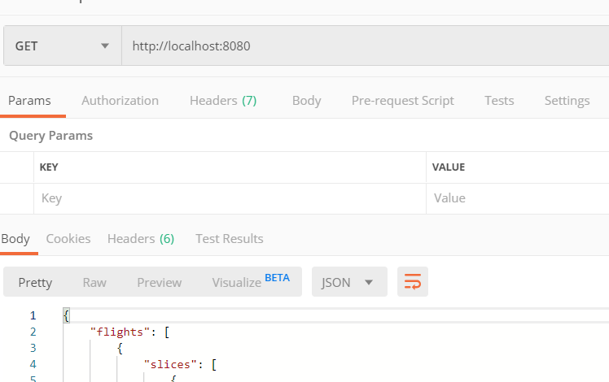

# About Flight Finder

Welcome to flight-finder.io. Motivation of this project is to aggregate flights from different sources (Comtravo discovery service). Application itself represents REST service with a single endpoint to find all flights.

## Installation

### Demo purpose

Make sure that you have installed [Docker Desktop](https://www.docker.com/products/docker-desktop) on your local machine before moving further.

The easiest way to spin up the whole application without installing any runtimes and dependencies is to run it within docker container. In the root of the project you may find `docker-compose.yml` file. This file contains definition of insfrastructure in term of dockerized application. By running a command:

```
docker-compose up
```

Flight Finder application is being deployed within Docker container and becomes available for GET request to find flights by the following URL `http://localhost:8080`.
Postman example:



### Development purpose

For running application in development mode following components have to be pre-installed:

- [Node.js](https://nodejs.org) 12.13
- npm 6.12 (includes within Node.js)

After installing above components, following command have to be executed from the project root to finish installation of project dependencies:

```
npm install
```

That's it!

Last step is to execute command to run the application:

```
npm start
```

This command starts Express.js service and make it available for GET request to find flights by the following URL `http://localhost:8080`

### Deployment purpose

Make sure that you have installed [Serverless Framework](https://serverless.com/framework/docs/getting-started/) on your local machine and AWS account is properly configured before moving further.

The project structured in the way to be able to run service within Docker container or as a Lambda function in AWS.

By running a command:

```
serverless deploy
```

Flight Finder service gets provisioned into AWS.

## Improvements

As a potential improvements following tasks have to be taken into account for the nearest future:

- Centralize place to handle 3rd-party services exceptions
- Add more tests
- Improve logging
- Add CI to build and run tests on each commit
